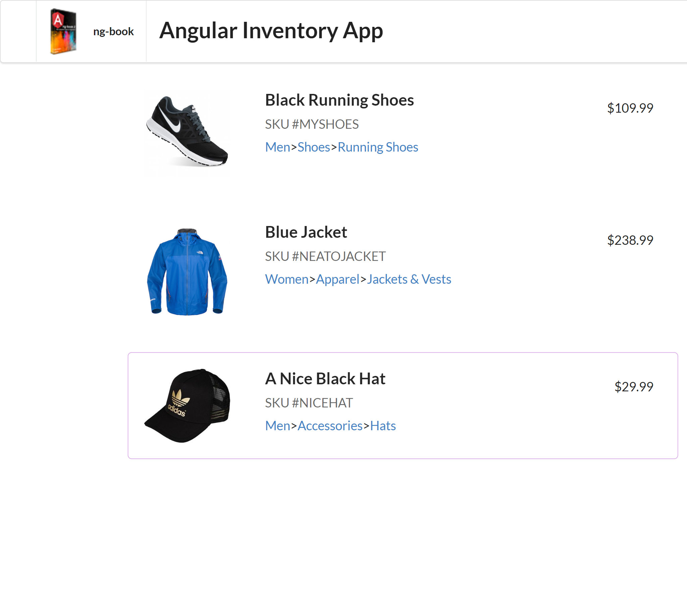
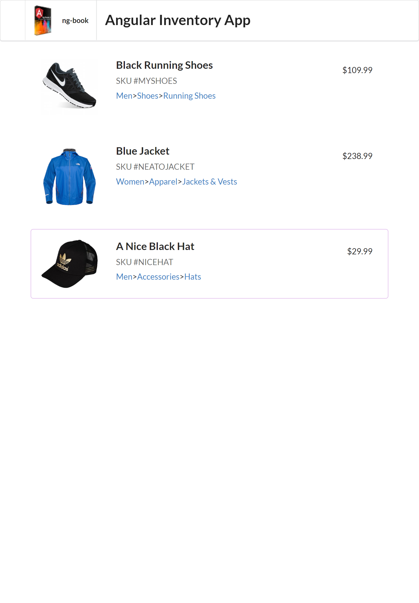
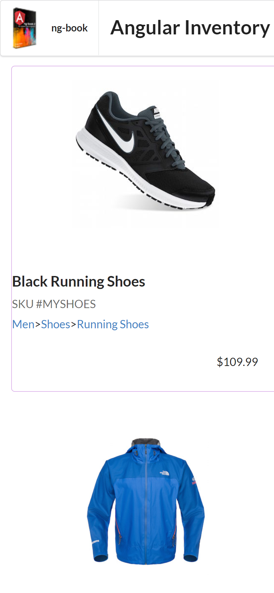

# ANGULAR INVENTORY APP

A Simple Inventory App In Angular

## Acknowledgements

- [Ng Book](https://www.amazon.com/ng-book-Complete-Angular-Nathan-Murray/dp/1985170280)

## Deployment

To deploy this project run

```bash
  npm install -g now
  cd dist/inventory-app
  now
```

## Demo

https://inventory-app-sigma-pied.vercel.app/

## Features

- Basic Angular Application
- Component Interaction
- Clean Code
- Design Patterns
- Angular Directives

## Feedback

If you have any feedback, please reach out to us at njugunajb96@gmail.com

## Screenshots

# Tablet



# Phone



